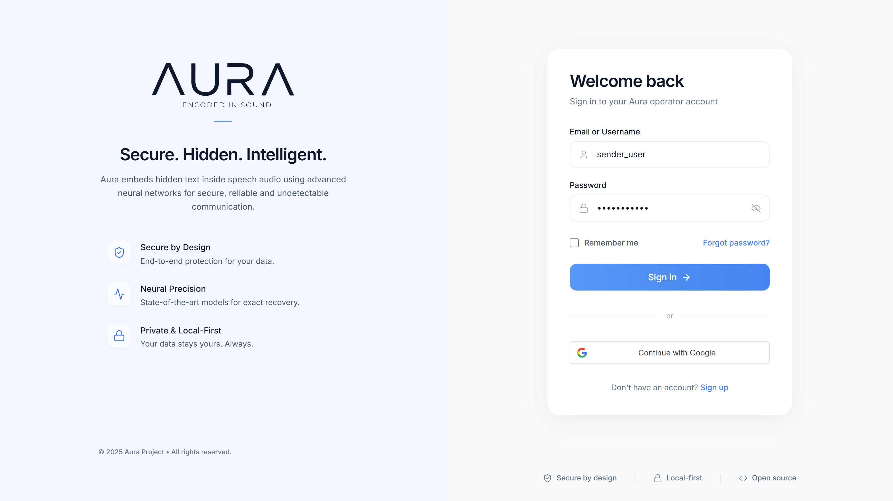
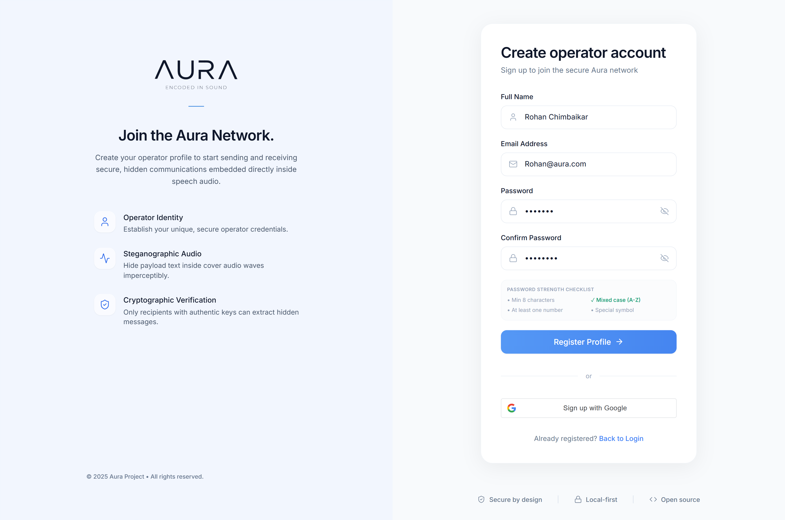
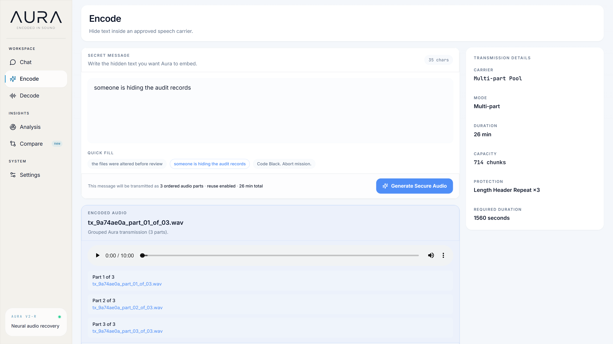
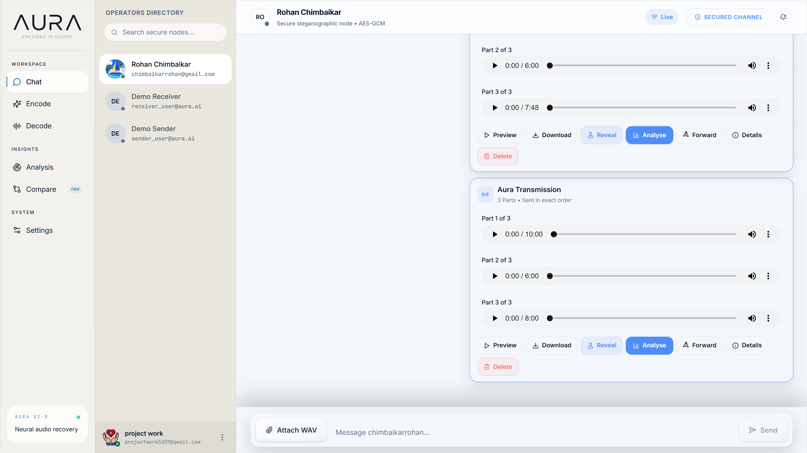
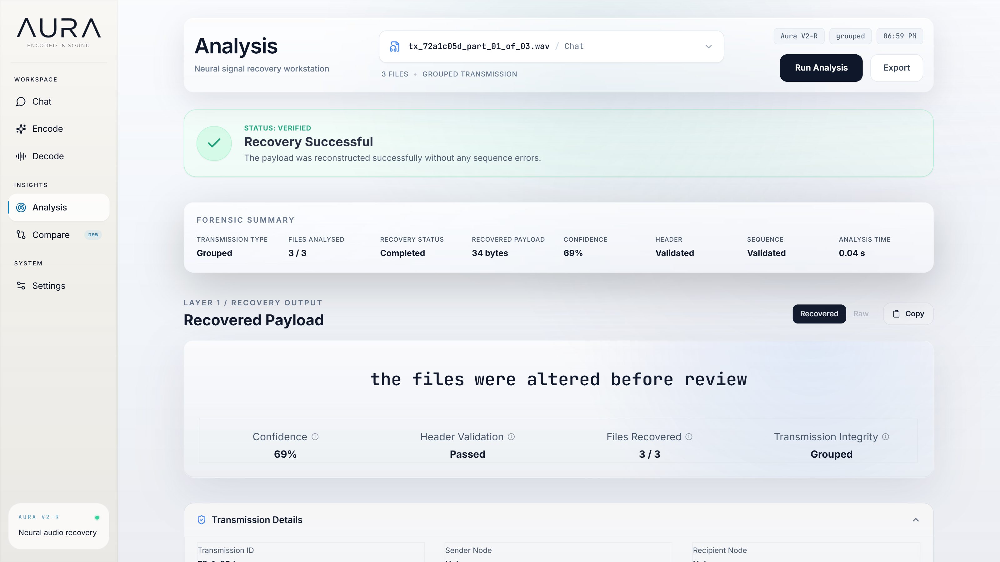
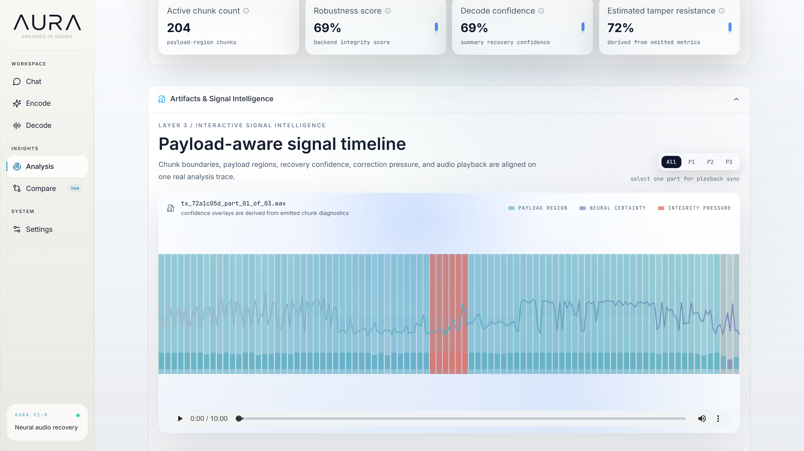
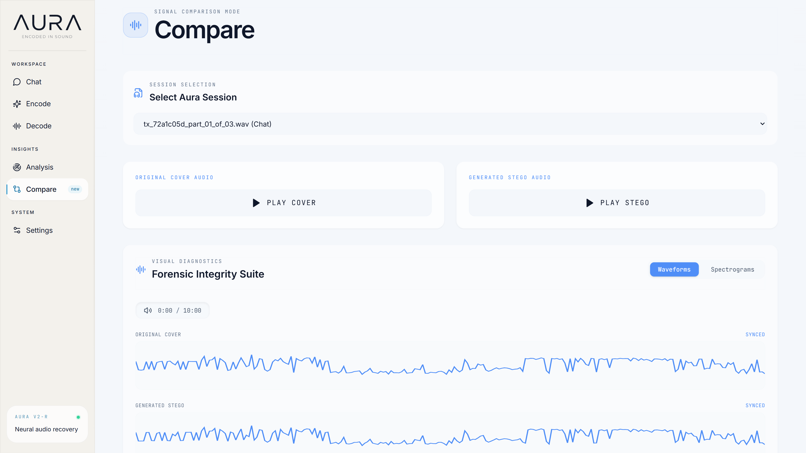
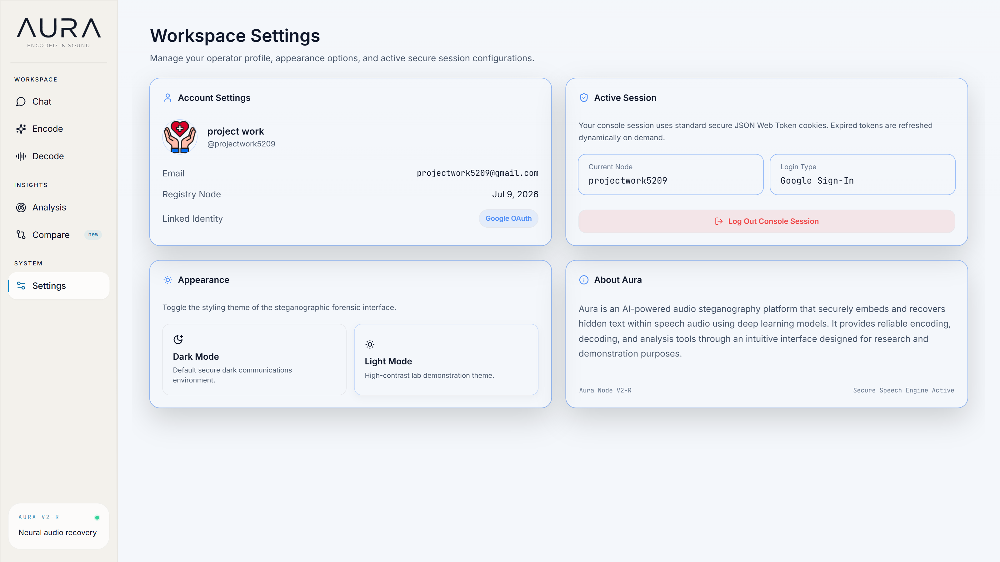

# AURA: Neural Audio Steganography

A security-oriented framework for robust covert audio communication using deterministic spectral domain embedding and deep neural network decoders.

[](LICENSE)
[](https://www.python.org/)
[](https://react.dev/)
[](https://www.typescriptlang.org/)
[](https://flask.palletsprojects.com/)
[](https://pytorch.org/)
[](https://github.com/RohanChimbaikar/Aura/stargazers)
[](https://github.com/RohanChimbaikar/Aura/commits/main)
[](https://github.com/RohanChimbaikar/Aura/actions)

---

## 2. Banner

<p align="center">
  
  
</p>

---

## 3. Overview

AURA (Audio Utility for Robust Steganography) is an advanced neural-assisted audio steganography platform designed for secure, covert text transmission over acoustic channels. Classic audio steganography systems frequently struggle with the trade-off between perceptual imperceptibility and robustness against transmission distortions (such as channel noise, spatial reverberation, and compression).

AURA addresses these issues using a hybrid system architecture:

* **Deterministic Spectral Encoding:** Text payloads are converted into nibble streams, protected by error-correcting codes, and directly embedded into specific mid-frequency bins of the log-magnitude spectrogram of carrier audio files using a deterministic Short-Time Fourier Transform (STFT) pipeline.
* **Deep Neural Decoding:** Instead of relying on fragile deterministic demodulators, recovery is performed using a deep Convolutional Neural Network (CNN) trained specifically to classify and reconstruct stego-bits from log-magnitude spectrogram chunks under noise-corrupted conditions.

This platform bridges the gap between signal processing theory and deep learning, offering a clean web interface for encoding, decoding, real-time message exchange, and detailed forensic analysis of steganographic audio.

---

## 4. Research Highlights

The following table summarizes the core technologies embedded within AURA, their technical implementations, and their research purpose:

| Core Technology                            | Implementation Detail                                                               | Research Purpose                                                                                                                                 |
| :----------------------------------------- | :---------------------------------------------------------------------------------- | :----------------------------------------------------------------------------------------------------------------------------------------------- |
| **STFT / ISTFT Processing**          | 512-sample Hanning window, 128-sample hop length, phase preservation.               | Transforms time-domain audio to the frequency domain for target band editing and back, preserving phase to ensure minimal perceptual distortion. |
| **Deterministic Spectral Embedding** | Amplitude modification (+/- 0.1 log-magnitude) of 4 speech-band sub-channels.       | Restricts embedding to stable human speech frequencies (750 Hz to 2625 Hz) to maintain high imperceptibility and prevent high-frequency decay.   |
| **AuraV2RDecoder CNN**               | PyTorch CNN (6 convolutional layers + Batch Norm + MaxPool + Linear heads).         | Translates extracted log-magnitude spectrogram frames into 4-bit nibble logit estimations, generalizing robustly against noise.                  |
| **Hamming(8,4) ECC**                 | 100% capacity overhead; systematic generator/parity check matrix.                   | Corrects single-bit transmission errors per nibble and detects double-bit errors, raising the channel capacity error-tolerance boundary.         |
| **CRC16 Checksum**                   | 16-bit Cyclic Redundancy Check (0xA001 polynomial) embedded in transmission header. | Verifies the integrity of the decoded bitstream, preventing false positives and validating correctness before text rendering.                    |
| **Flask REST Blueprints**            | Blueprints separated by domain (`auth`, `chat`, `file`, `aura`).            | Ensures modularity and separation of concern on the backend, organizing API endpoints for authentication, WebSocket, and steganography.          |
| **Socket.IO / WebSockets**           | Full-duplex connection for real-time chat payload exchanges.                        | Powers interactive chat environments where users can exchange generated stego-WAV files and trigger instantaneous decoding on reception.         |
| **JWT & Google OAuth 2.0**           | Stateless signed token validation & federated Google API handshake.                 | Secures access to forensic history, user messages, and carrier resources while protecting system APIs from unauthorized access.                  |

---

## 5. Key Features

### 🔒 Neural Audio Steganography

Combines deterministic, phase-preserving spectral embedding with a PyTorch CNN decoder (`AuraV2RDecoder`). This design maintains high imperceptibility in the time-domain wave while using neural pattern recognition to ensure high-fidelity bit recovery under noisy conditions.

### ✉️ Secure Hidden Messaging

Splits text payloads into bit vectors, wraps them in a 24-byte structured binary transmission header (including magic bytes, segment counters, and checksums), and applies a 3x repeat factor. The resulting payload is hidden in 2-second audio chunks using safe-carrier matching.

### 💬 Interactive Chat

A fully integrated, real-time chat system powered by WebSockets. Users can converse in plaintext or transmit encoded steganographic audio messages that recipients can instantly decode with a single click inside the chat interface.

### 🔬 Audio Forensics

Provides deep mathematical analysis of the carrier and stego audio. The system calculates and plots Signal-to-Noise Ratio (SNR), Mean Squared Error (MSE), Bit Error Rate (BER), and a weighted Forensic Integrity Score to verify security.

### 🎵 Carrier Audio Validation

Includes a pre-approved, validated carrier audio library ("Carrier Bank"). Carriers are vetted through pre-run simulations to ensure they have sufficient spectral density to support embedding without producing audible artifacts.

### 📊 Signal Comparison

Enables comparative forensic review of original and modified waveforms and spectrograms. The interface renders interactive charts showing exactly where modifications were applied in the frequency spectrum.

### 🔑 Authentication

A secure access control system featuring JSON Web Token (JWT) tokenization with local storage management alongside Google OAuth 2.0. This ensures secure storage of user-specific message histories and analysis runs.

### 📈 Modern Dashboard

An interactive React 19 dashboard utilizing Vite, TypeScript, and Recharts. Users can inspect chunk-by-chunk confidence intervals, error correction rates, and diagnostic timelines.

### ⚡ Real-Time Communication

Features bi-directional Socket.IO event mapping, allowing instant notifications when a user receives a stego-audio file, ready for instant in-line decoding and analysis.

---

## 6. Technical Innovations

AURA's architecture represents a series of deliberate engineering trade-offs designed to optimize the balance between reliability, security, and usability.

```
                      +-------------------------------------------------------------+
                      |                         AURA SYSTEM                         |
                      +-------------------------------------------------------------+
                                                     |
             +---------------------------------------+---------------------------------------+
             |                                                                               |
             v                                                                               v
+-------------------------+                                                     +-------------------------+
|      DETERMINISTIC      |                                                     |      DEEP LEARNING      |
|  SPECTRAL EMULATION     |                                                     |      NEURAL DECODER     |
+-------------------------+                                                     +-------------------------+
| Ensures zero phase      |                                                     | Employs PyTorch CNN     |
| distortion, constant    |                                                     | to classify stego-bits  |
| capacity bounding,      |                                                     | in noise-degraded       |
| and perfect encoder     |                                                     | spectrograms, yielding  |
| reproducibility.        |                                                     | channel robustness.     |
+-------------------------+                                                     +-------------------------+
```

### Deterministic Spectral-Domain Encoder

Many deep learning steganography research papers advocate for end-to-end trained encoder-decoder models. However, neural encoders frequently introduce unpredictable phase shifts or broadband noise that make the audio sound unnatural. AURA uses a **deterministic spectral-domain encoder**. By modifying only the log-magnitude spectrogram of a Hanning-windowed STFT at specific frequency bins (750 Hz to 2625 Hz) by a constant delta of $\pm 0.1$, AURA guarantees:

1. **Phase Preservation:** The original phase angle of the carrier audio is preserved and recombined during the Inverse Short-Time Fourier Transform (ISTFT), preventing phase-based audible artifacts.
2. **Constant Bounding:** The encoder's behavior is mathematically predictable, ensuring that steganographic adjustments never exceed safe thresholds.

### CNN-Based AuraV2RDecoder

While encoding is deterministic, decoding is handled by a **PyTorch CNN**. Standard frequency demodulation algorithms (like thresholding or matched filtering) fail when audio is compressed, bandpass-filtered, or played over the air. The `AuraV2RDecoder` model processes 2D log-magnitude spectrogram chunks, learning to classify whether a bit was embedded as $+0.1$ or $-0.1$ despite noise, reverberation, and channel fading.

### Synchronization Pattern Detection

Time-alignment is a common point of failure in audio communications. AURA implements a sliding-window time-domain synchronization search. The encoder embeds a robust 12-nibble sync pattern:

$$
\text{Sync} = [10, 10, 4, 1, 5, 5, 5, 2, 4, 1, 10, 10]
$$

The receiver searches across offset increments of $0.1$ seconds, analyzing shifts from $-2$ to $+2$ chunks, and aligning the decoding window to minimize the Bit Error Rate (BER) against the known sync pattern before extracting the payload.

### Error Correction and Validation

AURA uses a multi-layered verification strategy:

* **Hamming(8,4) ECC:** Doubles the payload size to ensure that single-bit errors in any nibble are corrected, and double-bit errors are flagged.
* **CRC16 Checksum:** Calculated with polynomial 0xA001. If the decrypted payload does not match the checksum, the recovery is flagged as failed.
* **Dictionary Correction:** A post-processing step checks recovered tokens against a local dictionary to fix common semantic artifacts caused by uncorrected bit-flips.

### Modular Flask Service Architecture

The backend is structured using a service-oriented architecture. Database operations, authentication flows, file management, and steganographic processes are decoupled into independent modules: `aura_service.py` (which orchestrates the encoder/decoder runners via safe subprocess isolation), `auth_service.py`, `file_service.py`, and `db.py`. This design allows developers to modify backend endpoints or swap deep learning model weights without altering core application logic.

### Integrated Forensic Workflow

Steganography relies on cover traffic remaining unsuspicious. AURA includes an integrated forensics workflow that allows security researchers to compare the modified file directly with the cover file. By computing waveform differences, delta-spectrograms, and local SNR, the platform makes the steganographic impact visible and quantifiable.

---

## 7. Architecture

The diagram below details AURA's data flow, illustrating the separation between the deterministic encoding pipeline and the neural decoding pipeline, as well as the database and frontend dashboard integrations:

```mermaid
graph TD
    %% Define styles
    classDef react fill:#003366,stroke:#33b5e5,stroke-width:2px,color:#ffffff;
    classDef flask fill:#222222,stroke:#00cc66,stroke-width:2px,color:#ffffff;
    classDef service fill:#444444,stroke:#ffbb33,stroke-width:2px,color:#ffffff;
    classDef ML fill:#5A2D82,stroke:#ff6600,stroke-width:2px,color:#ffffff;
    classDef db fill:#005A9C,stroke:#00d2ff,stroke-width:2px,color:#ffffff;
    classDef disk fill:#333333,stroke:#888888,stroke-width:2px,color:#ffffff;

    %% Nodes configuration
    subgraph FE [React 19 Frontend - TypeScript]
        UI[Main UI & Dashboard]:::react
        EncScreen[Encode Page]:::react
        RevScreen[Reveal Page V2]:::react
        AnalScreen[Forensic Dashboard]:::react
        ChatScreen[WebSocket Chat]:::react
    end

    subgraph BE [Flask API & Blueprints]
        AuthBP[auth_bp]:::flask
        ChatBP[chat_bp]:::flask
        FileBP[file_bp]:::flask
        AuraBP[aura_bp]:::flask
    end

    subgraph ServiceLayer [Service Layer]
        AuthSvc[auth_service.py]:::service
        MsgSvc[message_service.py]:::service
        FileSvc[file_service.py]:::service
        AuraSvc[aura_service.py]:::service
    end

    subgraph MLSteg [Steganography & ML Model Pipeline]
        DetEnc[Deterministic Spectral Encoder]:::ML
        SyncAlign[Time-Domain Sync Search]:::ML
        PyNet[AuraV2RDecoder CNN Model]:::ML
        ECC[Hamming 8,4 & CRC16 Engine]:::ML
    end

    subgraph DBStore [Storage & Database]
        Sqlite[(SQLite Database)]:::db
        CarrierBank[[Carrier Bank / WAVs]]:::disk
        StegoStore[[Outputs / Stego WAVs]]:::disk
        UploadsStore[[Uploads / Target WAVs]]:::disk
    end

    %% Flow lines
    UI --> EncScreen & RevScreen & AnalScreen & ChatScreen
  
    %% API Requests
    EncScreen -->|POST /api/encode| AuraBP
    RevScreen -->|POST /api/decode| AuraBP
    AnalScreen -->|POST /api/analysis| AuraBP
    ChatScreen -->|WebSocket: send_stego| ChatBP
  
    %% Blueprint to Service
    AuthBP --> AuthSvc
    ChatBP --> MsgSvc
    FileBP --> FileSvc
    AuraBP --> AuraSvc
  
    %% Service to Database/File
    AuthSvc --> Sqlite
    MsgSvc --> Sqlite
    AuraSvc --> Sqlite
    FileSvc --> UploadsStore
  
    %% Steganography Encoding Path
    AuraSvc -->|Read Cover| CarrierBank
    AuraSvc -->|Run Encoder| DetEnc
    DetEnc -->|Apply STFT & Modify Amplitude| DetEnc
    DetEnc -->|Recombine Phase & Run ISTFT| DetEnc
    DetEnc -->|Write Stego WAV| StegoStore
    AuraSvc -->|Return Reference| EncScreen
  
    %% Steganography Decoding Path
    AuraSvc -->|Read Stego/Uploaded Audio| UploadsStore
    AuraSvc -->|Invoke Decoder Runner| SyncAlign
    SyncAlign -->|Locate Sync Pattern| SyncAlign
    SyncAlign -->|Slice 2s Chunks| PyNet
    PyNet -->|Infer Spectral Logits| PyNet
    PyNet -->|Majority Vote & ECC Decode| ECC
    ECC -->|Verify CRC16 & Return Text| AuraSvc
    AuraSvc -->|Return Recovered Payload & BER| RevScreen
  
    %% Steganography Forensic Analysis Path
    AuraSvc -->|Load Original & Stego| CarrierBank & StegoStore
    AuraSvc -->|Calculate SNR, MSE, Spectral Difference| AuraSvc
    AuraSvc -->|Generate Forensic Charts| AnalScreen
```



---

## 8. Design Principles

AURA is built on six key engineering principles:

* **Modularity:** The project enforces a clean separation of concerns. Endpoints only handle HTTP/WebSocket routing, business services coordinate operations, and processing scripts run independently in isolated environments.
* **Maintainability:** Machine learning code is kept separate from backend web services. The deep learning model (`AuraV2RDecoder`) is treated as a self-contained processing step, allowing updates to model weights without breaking web APIs.
* **Explainability:** Steganography tools should not operate as "black boxes." AURA's forensic dashboard provides detailed, checkable metrics (such as chunk confidence, spectral diffs, and SNR calculations) so users can verify the security of their communication.
* **Reproducibility:** AURA uses a deterministic encoding process. Given the same cover audio and secret text, the system will output the exact same stego WAV, ensuring reliable testing and debugging.
* **Separation of Concerns:** The React client manages UI state, the Flask server handles orchestration, database storage, and session validation, while the PyTorch runtime performs deep learning inference.
* **Scalability:** The SQLite database is suitable for local development, but the service layer is designed to scale. The architecture is ready to integrate with Celery worker queues and PostgreSQL databases for enterprise deployments.

---

## 9. Screenshots

AURA provides a modern, responsive interface that guides users through secure message embedding, communication, decoding, and forensic analysis. The following screenshots showcase the primary components of the platform.

### Authentication

#### Login



*Figure 1: Secure authentication portal supporting JWT-based authentication and Google OAuth 2.0 sign-in.*

#### Sign Up



*Figure 2: User registration interface with secure account creation and validation.*

---

### Message Encoding



*Figure 3: Message embedding workspace where users compose secret messages, select approved carrier audio, and generate steganographic audio files.*

---

### Secure Communication



*Figure 4: Real-time chat interface supporting secure communication and transmission of encoded audio between authenticated users.*

---

### Audio Analysis




*Figure 5: Extended analysis view providing additional diagnostic information, quality metrics, and detailed signal inspection.*



*Figure 6: Primary forensic analysis dashboard presenting waveform visualizations, reconstruction metrics, and audio integrity measurements.*

---

### Signal Comparison



*Figure 7: Side-by-side comparison interface for evaluating original and steganographic audio using waveform and spectral visualizations.*

---

### Application Settings



*Figure 8: System configuration panel for authentication preferences, interface customization, carrier management, and application settings.*---

## 10. How It Works

AURA uses a structured process to hide and recover messages, split into four key stages:

```
[ SECRET TEXT ]
      |
      v
+-------------+      +--------------+      +-------------+      +-------------+
|  ENCODING   | ---> | TRANSMISSION | ---> |  DECODING   | ---> |  FORENSIC   |
|  PIPELINE   |      |   CHANNEL    |      |  PIPELINE   |      |  ANALYSIS   |
+-------------+      +--------------+      +-------------+      +-------------+
                                                                       |
                                                                       v
                                                                [ METRICS SUITE ]
```

### 1. Encoding Pipeline

* **Payload Structuring:** The input ASCII string is split into 4-bit nibbles. A 24-byte header is generated containing a magic identifier (`AURA`), the transmission ID, segment sequence details, the payload length, a CRC16 checksum, and padding.
* **Redundancy Coding:** The bitstream is duplicated 3 times for majority voting. If Hamming(8,4) is enabled, each 4-bit nibble is expanded into an 8-bit block using systematic parity check calculations.
* **Spectral Injection:** The selected cover audio is loaded at a fixed 16 kHz sample rate (mono). The system computes the Short-Time Fourier Transform (STFT) with a 512-sample Hanning window and 128-sample hop length.
* **Log-Magnitude Manipulation:** The bitstream is embedded into the log-magnitude spectrogram. The system modifies four selected frequency bands:
  * *Band 0:* [750 Hz - 1125 Hz] (Bins 24 - 36)
  * *Band 1:* [1250 Hz - 1625 Hz] (Bins 40 - 52)
  * *Band 2:* [1750 Hz - 2125 Hz] (Bins 56 - 68)
  * *Band 3:* [2250 Hz - 2625 Hz] (Bins 72 - 84)
    A value of $+0.1$ or $-0.1$ is added to the log-magnitude spectrum of each 2-second chunk to represent bits `1` or `0` respectively.
* **Audio Synthesis:** The original phase is combined with the modified log-magnitude spectrum, and the Inverse Short-Time Fourier Transform (ISTFT) is applied to reconstruct the stego WAV file.

### 2. Transmission Channel

* The stego WAV file is transmitted either via WebSocket chat within the platform or downloaded for manual distribution. AURA's design protects the hidden message against common transmission artifacts, including volume changes and ambient noise.

### 3. Decoding Pipeline

* **Synchronization Search:** The receiver loads the target audio file (at 16 kHz mono) and searches for the synchronization pattern `[10, 10, 4, 1, 5, 5, 5, 2, 4, 1, 10, 10]` by testing time shifts at $0.1$-second intervals.
* **Spectrogram Extraction:** Once aligned, the audio is split into 2-second chunks, and their log-magnitude spectrograms are computed.
* **Neural Inference:** The PyTorch `AuraV2RDecoder` model processes each spectrogram chunk, outputting 4 continuous logits representing the probability of each bit in the nibble.
* **Error Correction & Reconstruction:** The logits are converted to binary values. The system performs majority voting across the 3x repeated bits, corrects single-bit flips using Hamming(8,4) decoding, and verifies the message integrity with the CRC16 checksum. A dictionary check is then run to resolve any remaining minor spelling errors.

### 4. Forensic Analysis Pipeline

* The system loads both the original cover WAV and the generated stego WAV.
* It computes the difference in the time-domain waveform and generates a delta-spectrogram to isolate the embedded signal changes.
* The backend calculates global and chunk-level signal metrics (SNR, MSE, and BER) and returns these figures to the dashboard for visualization.

---

## 11. Tech Stack

| Technology                | Purpose                                                                                                             |
| :------------------------ | :------------------------------------------------------------------------------------------------------------------ |
| **React 19**        | User interface framework for building responsive, single-page application screens.                                  |
| **Vite**            | Frontend build tool and development server, optimized for fast builds and hot module replacement.                   |
| **TypeScript 5**    | Provides static typing across frontend interfaces to prevent runtime errors and ensure reliable API contracts.      |
| **Tailwind CSS**    | Utility-first CSS framework used to build AURA's clean, modern interface.                                           |
| **Recharts**        | Interactive charting library used to display signal differences and decoding diagnostics.                           |
| **Python 3.10+**    | The core programming language for the backend API and signal processing pipelines.                                  |
| **Flask 2.x+**      | Web framework used to define RESTful endpoints and route requests.                                                  |
| **SQLite 3**        | Lightweight relational database used to store message histories, user credentials, and analysis logs.               |
| **Flask-SocketIO**  | Enables real-time, bi-directional WebSocket communication for chat messages and file transfers.                     |
| **PyTorch 2.x+**    | Machine learning framework used to load weights and run inference for the`AuraV2RDecoder` model.                  |
| **Librosa / SciPy** | Libraries used for signal processing tasks, including audio loading, resampling, STFT/ISTFT, and spectral analysis. |
| **NumPy**           | Performs matrix operations on spectrograms and audio data.                                                          |
| **PyJWT**           | Generates and validates secure JSON Web Tokens for stateless user authentication.                                   |

---

## 12. Project Structure

```text
Aura/
├── backend/
│   ├── app.py                       # Flask application entry point
│   ├── requirements.txt             # Backend dependencies
│   ├── init_db.py                   # SQLite schema initialization script
│   ├── aura-model-v1/               # Machine Learning & model definition assets
│   │   ├── aura_v2r_sender.py       # Deterministic spectral encoding runner
│   │   ├── aura_v2r_receiver.py     # Sync search & PyTorch neural decoding runner
│   │   ├── aura_v2r_config.json     # Configuration file (bands, FFT size, strength)
│   │   ├── aura_v2r_decoder_only.pt # Pre-trained AuraV2RDecoder CNN weights
│   │   ├── aura_v2r_best.pt         # Optional backup model weights
│   │   └── aura_v2r_debug_roundtrip.py # Local simulation test script
│   ├── aura_carrier_bank/           # Pre-approved cover audio files (.wav)
│   ├── instance/                    # SQLite databases and session files
│   ├── outputs/                     # Generated stego audio outputs
│   ├── uploads/                     # Temp storage for uploaded audio files
│   ├── routes/                      # Flask blueprint modules
│   │   ├── auth_routes.py           # Identity, password hashing, Google token login
│   │   ├── chat_routes.py           # Chat history retrieval and socket setup
│   │   ├── file_routes.py           # Media download and upload streams
│   │   └── aura_routes.py           # Steganography, analysis, capacity previews
│   ├── services/                    # Service layer classes
│   │   ├── auth_service.py          # Session encryption and validation logic
│   │   ├── message_service.py       # DB adapters for message storage
│   │   ├── file_service.py          # IO checks, hashing, duplicate prevention
│   │   ├── db.py                    # Database connection context manager
│   │   └── aura_service.py          # Wrapper coordinating sub-process models
│   ├── sockets/                     # WebSocket connection handlers
│   └── tests/                       # Integration test files
├── frontend/
│   ├── index.html                   # Entry page template
│   ├── package.json                 # Node package configuration
│   ├── tsconfig.json                # TypeScript compiler settings
│   ├── vite.config.ts               # Vite build rules
│   ├── tailwind.config.js           # Styling tokens
│   ├── postcss.config.js            # PostCSS configuration
│   └── src/
│       ├── main.tsx                 # Client app mount point
│       ├── App.tsx                  # Root state coordinator and router
│       ├── types.ts                 # TypeScript type interfaces
│       ├── styles.css               # Global stylesheets
│       ├── data.ts                  # Static configurations and carrier lists
│       ├── components/              # UI widgets and layouts
│       │   └── ForensicCards.tsx    # Forensic metrics cards
│       ├── screens/                 # Dashboard panels
│       │   ├── LoginScreen.tsx      # Sign-in/Sign-up screen
│       │   ├── EncodePage.tsx       # Text encoding panel
│       │   ├── RevealPageV2.tsx     # Message recovery panel
│       │   ├── AnalysisPageV2.tsx   # Detailed analysis interface
│       │   ├── CompareScreen.tsx    # Signal analysis workspace
│       │   └── SettingsPageV2.tsx   # Diagnostics configuration panel
│       └── services/                # API wrappers
└── README.md                        # Master project documentation
```

---

## 13. Installation

AURA requires **Python 3.10+** (with `pip`) and **Node.js 18+** (with `npm`).

### 1. System Pre-requisites
### Install FFmpeg (Windows)

Using Winget (recommended):

```powershell
winget install Gyan.FFmpeg
```

Verify the installation:

```powershell
ffmpeg -version
```
### Install FFmpeg (Windows)

Using Winget (recommended):

```powershell
winget install Gyan.FFmpeg
```

Verify the installation:

```powershell
ffmpeg -version
```
### 2. Backend Setup

1. Navigate to the backend directory:
   ```bash
   cd backend
   ```
2. Create a virtual environment:
   ```bash
   # Windows
   python -m venv .venv
   .venv\Scripts\activate

   # macOS/Linux
   python3 -m venv .venv
   source .venv/bin/activate
   ```
3. Install dependencies:
   ```bash
   pip install -r requirements.txt
   ```
4. Initialize the SQLite database schema:
   ```bash
   python init_db.py
   ```

### 3. Frontend Setup

1. Navigate to the frontend directory:
   ```bash
   cd ../frontend
   ```
2. Install dependencies:
   ```bash
   npm install
   ```

### 4. Running the Development Servers

1. **Start Backend API:**
   Navigate to the `backend` directory, activate the virtual environment, and run:

   ```bash
   python app.py
   ```

   The server will start at `http://localhost:5000`.
2. **Start Frontend SPA:**
   Navigate to the `frontend` directory and run:

   ```bash
   npm run dev
   ```

   The client will start at `http://localhost:5173`. Open this URL in your web browser.

---

## 14. Environment Variables

The application is configured using environment variables. Create a `.env` file in the project root by copying `.env.example`:

| Variable Name                        | Required | Default Value             | Description                                      |
| :----------------------------------- | :------: | :------------------------ | :----------------------------------------------- |
| `VITE_API_BASE_URL`                |   Yes   | `http://localhost:5000` | The backend API URL used by the React client.    |
| `VITE_GOOGLE_CLIENT_ID`            |    No    | `""`                    | Client ID for Google OAuth login.                |
| `JWT_SECRET_KEY`                   |   Yes   | `your-jwt-secret-key`   | Secret key used to sign session JSON Web Tokens. |
| `JWT_ACCESS_TOKEN_EXPIRES_MINUTES` |    No    | `15`                    | Expiration time for JWT access tokens.           |
| `JWT_REFRESH_TOKEN_EXPIRES_DAYS`   |    No    | `7`                     | Expiration time for JWT refresh tokens.          |
| `GOOGLE_CLIENT_ID`                 |    No    | `""`                    | Backend client ID validating Google tokens.      |
| `GOOGLE_CLIENT_SECRET`             |    No    | `""`                    | Client secret for Google API authentication.     |
| `SMTP_HOST`                        |    No    | `smtp.gmail.com`        | SMTP host for email notifications.               |
| `SMTP_PORT`                        |    No    | `587`                   | SMTP port for email notifications.               |
| `SMTP_USER`                        |    No    | `""`                    | Sender email address.                            |
| `SMTP_PASSWORD`                    |    No    | `""`                    | SMTP password or app-specific password.          |
| `SMTP_SENDER`                      |    No    | `noreply@aura.ai`       | From address on system emails.                   |

---

## 15. Usage

Here is the step-by-step workflow to encode, transmit, and analyze a message:

```
[ LOGIN ] -> [ CHOOSE CARRIER & TEXT ] -> [ GENERATE STEGO ] -> [ TRANSMIT / CHAT ] -> [ REVEAL & ANALYZE ]
```

1. **Login & Authentication:**
   * Open `http://localhost:5173` and create a local account, or log in with your Google credentials.
2. **Select Carrier and Enter Payload:**
   * Navigate to the **Encode Page**.
   * Select a carrier file from the pre-approved list (e.g., `meet_me.wav`).
   * Enter your secret text message. The interface will show a live character capacity preview.
3. **Generate Stego Audio:**
   * Click **Encode**. The system runs the STFT pipeline, embeds the payload in the selected frequency bands, applies phase preservation, and writes the output WAV file to `backend/outputs/`.
   * You can listen to the generated file or click **Download** to save it locally.
4. **Send via WebSocket Chat:**
   * Open the **Chat Page**, select a contact, and upload the generated stego audio.
   * The recipient will see the audio file render inside their message history.
5. **Decode Hidden Payloads:**
   * On receiving a stego file in chat (or uploading one on the **Reveal Page**), click **Reveal**.
   * The backend runs the `AuraV2RDecoder` model, aligns the signal using the synchronization pattern, performs neural decoding, corrects bit errors, and displays the recovered message.
6. **Run Forensic Analysis:**
   * On the **Forensic Dashboard**, select the audio run.
   * The dashboard displays SNR, MSE, and confidence graphs showing where modifications were made, giving a detailed view of the steganographic footprint.

---

## 16. Performance Metrics

To evaluate the imperceptibility of the stego audio and the reliability of the communication channel, AURA computes four forensic metrics:

### 1. Signal-to-Noise Ratio (SNR)

SNR measures the ratio of the power of the original carrier audio (signal) to the power of the steganographic modifications (noise). It is expressed in decibels (dB):

$$
\text{SNR}_{\text{dB}} = 10 \log_{10} \left( \frac{\sum_{n=1}^{N} x_{\text{cover}}[n]^2}{\sum_{n=1}^{N} (x_{\text{stego}}[n] - x_{\text{cover}}[n])^2} \right)
$$

Higher SNR values indicate that the steganographic modifications are smaller, making the hidden payload less perceptible.

### 2. Mean Squared Error (MSE)

MSE measures the average squared difference between the time-domain samples of the cover and stego audio files:

$$
\text{MSE} = \frac{1}{N} \sum_{n=1}^{N} \left( x_{\text{stego}}[n] - x_{\text{cover}}[n] \right)^2
$$

An MSE of zero indicates that the files are identical. Low MSE values confirm that the steganographic modifications have caused minimal physical change to the audio signal.

### 3. Bit Error Rate (BER)

BER measures the accuracy of the transmission channel by calculating the ratio of incorrectly decoded bits to the total number of embedded bits:

$$
\text{BER} = \frac{\text{Incorrect Bits}}{\text{Total Embedded Bits}}
$$

A BER of 0.0 indicates perfect message recovery before any error-correcting codes are applied.

### 4. Forensic Integrity Score

The Forensic Integrity Score is a combined rating of recovery reliability and imperceptibility. It is calculated by weighting the SNR, MSE, and validation checks (such as CRC16 and synchronization pattern matching):

$$
\text{Integrity Score} = w_1 \cdot \text{SNR}_{\text{normalized}} + w_2 \cdot (1 - \text{MSE}_{\text{normalized}}) + w_3 \cdot \text{Checksum}_{\text{valid}}
$$

This score helps users verify at a glance that the message was decoded reliably and that the stego audio remains secure.

---

## 17. Security Notes

* **Authentication & Access Control:**
  All API endpoints are protected using JWT authorization. Tokens are stored in local storage and sent in the `Authorization` header of each request. The Google OAuth token handler validates credentials directly against Google identity providers.
* **Input & Audio Validation:**
  To protect the system from resource exhaustion and exploit attempts:
  * Payload inputs are limited to standard ASCII text, preventing buffer issues during binary conversion.
  * Uploaded audio files must use the WAV container format, have a sample rate of 16 kHz, and contain only a single (mono) channel.
  * File uploads are capped at a maximum duration (typically 30 seconds) to limit processing loads.
* **Information Leakage Protection:**
  AURA uses pre-approved carrier files to prevent user-supplied files from leaking sensitive metadata (such as ID3 tags, coordinate logs, or creation times).
* **Database Security:**
  All database transactions are handled using parameterized SQLite queries to prevent SQL injection. Passwords are hashed using bcrypt before storage.

---

## 18. AI Pipeline

AURA's neural decoding process uses a hybrid pipeline combining digital signal processing and deep learning:

```
+---------------+     +---------------+     +---------------+     +---------------+     +---------------+
|  AUDIO INPUT  | --> |   LOG-SPECT   | --> | AuraV2RDecoder| --> | MAJORITY VOTE | --> | DECODED NIBBLE|
| (16kHz Mono)  |     |  (512 N-FFT)  |     |   CNN MODEL   |     |  & ECC CHECK  |     |   (4 BITS)    |
+---------------+     +---------------+     +---------------+     +---------------+     +---------------+
```

### 1. Signal Preprocessing

The incoming audio is resampled to 16 kHz mono. The system runs a sliding-window search to locate the synchronization pattern. Once aligned, the audio is split into 2-second chunks.

### 2. Feature Extraction

Each chunk is transformed into the frequency domain using a Short-Time Fourier Transform (STFT):

* *Window Function:* Hanning
* *FFT Size ($N_{\text{fft}}$):* 512 samples (32 ms window)
* *Hop Size:* 128 samples (75% overlap)
  The resulting magnitude spectrogram is converted to log-magnitude coordinates:

$$
\mathbf{X}_{\text{log}} = \log(1 + \mathbf{X}_{\text{magnitude}})
$$

This compresses the dynamic range, providing a stable input feature matrix of size $(257 \text{ frequency bins} \times 250 \text{ time frames})$.

### 3. Model Architecture (`AuraV2RDecoder`)

The model is a 2D CNN built in PyTorch:

* **Convolutional Stage:** Six layers of 2D convolutions using $3 \times 3$ kernels, Batch Normalization, and ReLU activation functions. Max-pooling layers reduce spatial resolution.
* **Global Pooling:** An Adaptive Average Pooling layer compresses features down to a $128$-dimensional vector.
* **Classification Head:** A Fully Connected network maps the $128$ features to $4$ output logits, representing the probabilities of the bits in the decoded nibble.

```python
class AuraV2RDecoder(nn.Module):
    def __init__(self, out_bits=4, base_ch=32):
        super().__init__()
        self.net = nn.Sequential(
            nn.Conv2d(1, base_ch, kernel_size=3, padding=1),
            nn.BatchNorm2d(base_ch),
            nn.ReLU(),
            nn.Conv2d(base_ch, base_ch, kernel_size=3, padding=1),
            nn.BatchNorm2d(base_ch),
            nn.ReLU(),
            nn.MaxPool2d(2),
    
            nn.Conv2d(base_ch, base_ch * 2, kernel_size=3, padding=1),
            nn.BatchNorm2d(base_ch * 2),
            nn.ReLU(),
            nn.Conv2d(base_ch * 2, base_ch * 2, kernel_size=3, padding=1),
            nn.BatchNorm2d(base_ch * 2),
            nn.ReLU(),
            nn.MaxPool2d(2),
    
            nn.Conv2d(base_ch * 2, base_ch * 4, kernel_size=3, padding=1),
            nn.BatchNorm2d(base_ch * 4),
            nn.ReLU(),
            nn.AdaptiveAvgPool2d((1, 1))
        )
        self.head = nn.Sequential(
            nn.Flatten(),
            nn.Linear(base_ch * 4, base_ch * 4),
            nn.ReLU(),
            nn.Linear(base_ch * 4, out_bits) # Outputs 4 logits
        )

    def forward(self, x):
        return self.head(self.net(x))
```

### 4. Post-Processing & Reconstruction

* Logits are converted to binary values using a Sigmoid function thresholded at 0.5.
* The system performs majority voting across the 3x repeat factors to resolve random noise errors.
* Hamming(8,4) decoding corrections are applied to fix single-bit errors.
* The final 4-bit nibbles are recombined into 8-bit bytes to reconstruct the ASCII message.

---

## 19. Future Improvements

AURA's development roadmap outlines planned improvements for future releases:

* **Unicode (UTF-8) Support:** Extend the encoding pipeline to support multi-byte Unicode characters, allowing the transmission of international text and symbols.
* **Custom Carrier Uploads:** Allow users to upload custom carrier files, utilizing an automated screening process to verify their noise floor, spectral density, and suitability.
* **Adaptive Embedding Strength:** Implement an adaptive embedding algorithm that dynamically scales the modification strength based on the local energy of the carrier, improving imperceptibility in quiet passages.
* **Progressive Decoding:** Enable real-time, progressive decoding of audio streams so users can read incoming messages before the entire file finishes playing.
* **End-to-End Deep Steganography:** Integrate training scripts to train the encoder and decoder together, optimizing both payload recovery and audio quality using adversarial training methods.
* **Advanced Error Correction:** Add Reed-Solomon or Low-Density Parity-Check (LDPC) codes to improve recovery rates over highly degraded transmission channels.
* **Stereo Audio Support:** Support two-channel (stereo) audio, allowing data to be embedded in both channels to double transmission capacity.
* **GPU Acceleration:** Update the backend to use GPU acceleration, speeding up decoding times for long audio streams.
* **Production Scaling:** Transition the backend to use PostgreSQL databases, Redis key-value stores, and Celery worker queues to support high-concurrency deployments.

---

## 20. Contributing

We welcome contributions to AURA. Please follow these guidelines:

1. **Fork the Repository:** Create a personal copy of the repository on GitHub.
2. **Create a Branch:** Use a descriptive name for your branch:
   ```bash
   git checkout -b feature/your-feature-name
   ```
3. **Coding Standards:** Keep code organized, follow PEP 8 style guidelines for Python, and use TypeScript interfaces for frontend code.
4. **Test Your Changes:** Run local round-trip simulations to verify that your changes do not affect decoding accuracy:
   ```bash
   python backend/aura-model-v1/aura_v2r_debug_roundtrip.py
   ```
5. **Submit a Pull Request:** Describe your changes in detail and submit your pull request to the `main` branch for review.

---

## 21. License

This project is licensed under the MIT License. See the [LICENSE](LICENSE) file for details.

---

## 22. Credits

AURA was developed as an academic engineering project focused on neural-assisted audio steganography. It was built to demonstrate how digital signal processing and deep learning can be combined to create robust, covert acoustic communication systems.

---

## 23. Disclaimer

> [!WARNING]
> **AURA is intended exclusively for academic research, education, and legitimate security experimentation.** It is not a replacement for cryptographic encryption systems. The steganographic techniques implemented in this software do not encrypt the hidden text; they only conceal its existence. Users should combine AURA with strong encryption tools (such as PGP or AES) when transmitting sensitive data over insecure networks. The developers assume no liability for misuse or damage caused by this software.

---

## 24. Footer

*AURA: Bridging signal processing and deep neural networks for secure covert communication.*

Developed and maintained by the AURA Project contributors. For support, bug reports, or feature requests, please open an issue in the repository.
